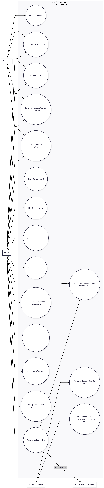

= Cahier des charges finalisé - Your Car Your Way
:toc:
:toclevels: 2
:sectnums:

== Objet du document

Ce document présente le cahier des charges fonctionnel de la future
application centralisée Your Car Your Way.

Il regroupe :

* l’analyse des besoins utilisateurs ;
* la consolidation des besoins métier exprimés par le client ;
* les besoins complétés nécessaires au cadrage du produit ;
* les spécifications fonctionnelles, structurées par épics, priorisées et
  traduites en user stories avec critères d’acceptation.

== Sources prises en compte

[cols="1,3", options="header"]
|===
| Source | Usage

| `consigne du projet`
| Cadrage global du projet, objectifs attendus et points de vigilance.

| `cahier des charges initial`
| Expression initiale des besoins métier et des règles déjà explicites formulés par Your Car Your Way.

| `acriss car codes`
| Référence sur la classification normalisée des véhicules à intégrer aux besoins.
|===

== Périmètre du document

Ce cahier des charges couvre les besoins utilisateurs et les spécifications
fonctionnelles de la future application centralisée de réservation de
véhicules, en incluant :

* les clients finaux de l’application ;
* les personnes en situation de handicap ;
* les usages internationaux ;
* les besoins d’interfaçage avec les applications d’agence via API ;
* le besoin d’assistance par tchat, retenu comme fonctionnalité représentative
  pour la suite du projet.

Ce document ne couvre pas :

* les choix techniques et d’architecture ;
* la conception détaillée de la PoC ;
* les modalités de réalisation technique, d’intégration ou de déploiement.

== Méthode de lecture des besoins

Afin de distinguer clairement l’expression initiale du besoin et les éléments
complémentaires nécessaires au cadrage, les besoins sont présentés en deux
groupes :

* les besoins déjà exprimés dans le cahier des charges initial fourni par Your car Your way ;
* les besoins complétés par déduction pour rendre le besoin utilisateur
  exploitable, cohérent, accessible, international et compatible avec la suite
  du projet.

Chaque besoin déduit reste cohérent avec les documents sources et ne contredit
pas le cahier des charges initial.

== Analyse des besoins utilisateurs

=== Acteurs pris en compte

[cols="1,3", options="header"]
|===
| Acteur | Finalité principale

| Prospect
| Rechercher une agence, consulter des offres et comprendre les conditions avant réservation.

| Client
| Réserver une location, gérer son profil et suivre ses réservations, selon les
préconditions décrites dans les cas d’usage et les spécifications détaillées.

| Système d’agence consommant l’API
| Consulter et modifier les données métiers nécessaires aux opérations en agence.
|===

L’internationalisation et l’accessibilité constituent des exigences transverses de conception applicables à l’ensemble des parcours client. Les différences de situation d’usage, notamment entre un client authentifié, client avec réservation ou client réalisant une action sensible sont décrites dans les spécifications fonctionnelles détaillées.

=== Diagramme de cas d’usage

Le diagramme ci-dessous donne une vue synthétique des principaux acteurs et cas
d’usage couverts par le cahier des charges fonctionnel.

=== Besoins déjà exprimés dans le cahier des charges initial

Les besoins ci-dessous sont explicitement présents dans
le cahier des charges fourni par Your Car Your Way.

==== Gestion du profil client

* Consulter son profil via la page de profil.
* Modifier ses informations personnelles via la page de profil: nom, prénom, date de naissance,
  adresse.
* Supprimer son compte.
* Confirmer la suppression du compte par la saisie du mot de passe.

==== Recherche d’agences et d’offres

* Consulter la liste des agences de location.
* Rechercher des offres à partir des critères suivants :
** ville de départ ;
** ville de retour ;
** date et heure de départ ;
** date et heure de retour ;
** catégorie du véhicule.
* Consulter le détail d’une offre de location.

==== Réservation et paiement

* Réserver une location à partir d’une offre.
* Fournir ses informations personnelles lors de la réservation.
* Effectuer le paiement.
* Externaliser le paiement auprès d’un fournisseur de service de paiement en
  ligne.

==== Suivi du parcours de location

* Consulter l’historique des réservations passées et en cours.
* Modifier une réservation.
* Annuler une réservation.

==== Règles métier déjà explicites

* Une offre de location comprend :
** une ville de départ ;
** une ville de retour ;
** une date et une heure de départ ;
** une date et une heure de retour ;
** une catégorie de véhicule ;
** un tarif.
* La modification d’une réservation est possible jusqu’à 48 heures avant le
  début de la réservation.
* À moins d’une semaine du début de la réservation, le remboursement n’est que
  de 25 % du montant total.
* Les catégories de véhicule reprennent la norme ACRISS.

==== Besoins d’intégration avec les agences

* Les applications utilisées en agence doivent avoir accès à une API.
* Cette API doit permettre des opérations CRUD standard pour chaque domaine,
  par exemple utilisateur, réservation, etc.

=== Besoins complétés par déduction

Les besoins suivants ne sont pas formulés explicitement tels quels dans le
cahier initial, mais ils sont nécessaires pour transformer la demande en une
base de travail exploitable, cohérente avec l’expression du besoin client et
adaptée à la suite du projet.

==== Besoins liés aux acteurs et aux parcours

* Distinguer les parcours du prospect et du client, car tous les utilisateurs
  ne sont pas au même niveau d’engagement.
* Détailler dans les cas d’usage et les spécifications les préconditions
  nécessaires à certaines actions du client, notamment l’authentification,
  l’existence d’une réservation et les règles de modification ou
  d’annulation.
* Considérer le système d’agence comme un utilisateur du système au sens
  fonctionnel, puisqu’il consomme l’API métier.
* Traiter l’internationalisation et l’accessibilité comme des exigences
  transverses applicables à tous les parcours clients.

==== Besoins de parcours et de continuité d’usage

* Permettre à un utilisateur de comprendre rapidement ce que propose une offre
  avant de réserver.
* Présenter les conditions tarifaires, les règles de modification et les règles
  d’annulation de manière compréhensible avant validation.
* Rendre le parcours de réservation cohérent entre la recherche, le détail de
  l’offre, la saisie des informations, le paiement et la confirmation.
* Donner à l’utilisateur une vision claire de l’état de sa réservation :
  confirmée, modifiable, annulable, passée ou en cours.
* Permettre au client de retrouver facilement les informations utiles après
  paiement : récapitulatif, dates, lieu de départ, lieu de retour, catégorie du
  véhicule, montant payé.

==== Besoins d’accessibilité et de prise en compte des PSH

* Assurer la conformité aux normes d’accessibilité en vigueur, notamment le RGAA
  en France.
* Garantir une navigation complète au clavier sur tout le parcours.
* Assurer la compatibilité avec les lecteurs d’écran.
* Fournir des libellés explicites, des messages d’erreur compréhensibles et des
  formulaires utilisables sans ambiguïté.
* Garantir des contrastes suffisants et une hiérarchie d’information lisible.
* Éviter les dépendances exclusives à la couleur, au survol ou à des
  interactions non accessibles.
* Permettre à un utilisateur de comprendre les conséquences d’une action
  sensible, par exemple une suppression de compte ou une annulation de
  réservation.

==== Besoins d’internationalisation

* Permettre l’usage de plusieurs langues dans l’interface.
* Afficher clairement les dates, heures et fuseaux horaires de départ et de
  retour.
* Prévoir la gestion de plusieurs devises ou, à défaut, rendre explicite la
  devise utilisée.
* Accepter des formats d’adresses, de noms et de numéros de téléphone adaptés à
  plusieurs pays.
* Éviter les formulations ambiguës sur les horaires et les lieux pour un
  utilisateur non local.

==== Besoins d’écoconception et de sobriété numérique

* Limiter les étapes, contenus et chargements non nécessaires dans les parcours
  principaux.
* Fournir en priorité les informations utiles à la décision et à la
  réservation, sans surcharge fonctionnelle.
* Éviter les médias, scripts ou composants non indispensables au service rendu.
* Permettre un usage fluide sur des terminaux et réseaux contraints.
* Limiter les transferts de données inutiles, notamment lors de la recherche,
  de la consultation d’offres et du tchat.

==== Besoins de confiance, sécurité et protection des données

* Sécuriser les actions sensibles du parcours utilisateur, notamment la
  suppression de compte, l’accès au profil et les opérations sur réservation.
* Rassurer l’utilisateur sur l’usage de ses données personnelles et respecter la réglementation de respect des données la plus stricte dans l'ensemble des pays où l'application est utilisée (RGPD ici).
* Encadrer les échanges avec le prestataire de paiement sans exposer de
  traitement de paiement sensible dans l’application métier.
* Prévoir une information claire en cas d’échec de paiement, d’annulation ou de
  modification impossible.
* Garantir une traçabilité des actions critiques pour les besoins
  d’exploitation et de support.

==== Besoins liés à la classification des véhicules

* Rendre compréhensible la classification ACRISS pour un utilisateur non
  expert.
* Permettre à l’utilisateur de comparer les offres sur des critères lisibles,
  même si la donnée métier repose sur un code ACRISS.
* Utiliser la norme ACRISS comme référence commune entre le parcours client et
  les systèmes d’agence.

==== Besoins d’assistance et de tchat

* Prévoir un besoin d’assistance utilisateur pendant le parcours.
* Cadrer le tchat comme un canal d’aide, sans étendre le besoin à toute la relation client.
* Permettre a minima l’échange de messages entre un client et un interlocuteur
  de support ou un dispositif d’assistance.

==== Besoins d’intégration avec les systèmes d’agence

* Structurer les données métiers de manière suffisamment cohérente pour être
  exposées par domaine via API.
* Prévoir des droits d’accès distincts selon les domaines manipulés par les
  applications d’agence.
* Assurer la cohérence entre les actions effectuées côté client et les actions
  effectuées via les outils d’agence.
* Permettre la coexistence temporaire entre la future application centralisée et
  les applications d’agence déjà en place.

== Synthèse des besoins utilisateurs consolidés

L’analyse des besoins fait apparaître un besoin produit plus large que la seule
liste fonctionnelle initiale. La future application doit permettre de
rechercher, réserver, payer, consulter et gérer une location de véhicule, mais
elle doit aussi :

* être exploitable à l’international ;
* être accessible aux personnes en situation de handicap ;
* être conçu selon des principes de sobriété numérique et d’écoconception ;
* exposer une API métier pour les agences ;
* expliciter les règles métier de réservation, modification et remboursement ;
* offrir un parcours fiable et compréhensible avant, pendant et après la
  réservation ;
* intégrer un besoin d’assistance représentatif à travers le tchat.

== Spécifications fonctionnelles

=== Principes de structuration

Les fonctionnalités sont regroupées par épics afin de disposer d’une vision
macro du produit avant la déclinaison détaillée en user stories.

La priorisation repose sur la méthode MoSCoW :

* Must : indispensable à la mise en service de la première version ;
* Should : important pour la qualité de service, sans bloquer l’ouverture ;
* Could : utile mais non indispensable à la première version ;
* Won't for now : hors périmètre de la première version.

=== Vue macro par épics

[cols="1,3,1", options="header"]
|===
| Epic | Finalité | Priorité

| EPIC-01 Gestion du compte client
| Permettre au client de créer, consulter, mettre à jour et supprimer son compte.
| Must

| EPIC-02 Recherche d’agences et d’offres
| Permettre au prospect ou au client de rechercher des agences et des offres adaptées à son besoin.
| Must

| EPIC-03 Consultation d’une offre
| Permettre à l’utilisateur d’évaluer une offre avant réservation.
| Must

| EPIC-04 Réservation et paiement
| Permettre au client de confirmer une location et de la payer via un prestataire externe.
| Must

| EPIC-05 Suivi, modification et annulation de réservation
| Permettre au client de suivre ses réservations et d’agir dessus selon les règles métier.
| Must

| EPIC-06 Assistance par tchat
| Permettre au client de solliciter une assistance pendant son parcours.
| Should

| EPIC-07 API pour les applications d’agence
| Permettre aux systèmes d’agence de consulter et modifier les données métiers via API.
| Must
|===

=== Exigences transverses

Les exigences d’accessibilité, de prise en compte des PSH,
d’internationalisation, d’écoconception et de compréhension des actions
sensibles ne sont pas traitées comme un bloc fonctionnel autonome. Elles
s’appliquent directement aux fonctionnalités concernées et doivent être prises
en compte dès leur spécification.

À ce titre :

* tout parcours utilisateur doit rester compréhensible, y compris en cas
  d’erreur ou d’échec d’une action ;
* les formulaires et messages doivent être utilisables par des personnes en
  situation de handicap ;
* les informations de date, d’heure, de lieu et de devise doivent rester
  interprétables dans un contexte international ;
* les parcours doivent limiter les chargements, traitements et contenus non
  nécessaires au besoin utilisateur ;
* les écrans clés doivent rester utilisables sur des terminaux et des
  connexions contraints ;
* les données affichées et échangées doivent rester proportionnées à l’usage
  attendu ;
* les actions sensibles doivent présenter explicitement leurs conséquences.

=== User stories et critères d’acceptation

==== EPIC-01 Gestion du compte client

===== US-01 Création de compte

En tant que prospect, je veux créer un compte client afin de finaliser une
réservation et retrouver mes informations lors d’un prochain usage.

Critères d’acceptation :

* Étant donné un prospect, quand il saisit les informations obligatoires
  attendues pour créer un compte, alors le système enregistre le compte et
  confirme sa création.
* Étant donné un prospect, quand une information obligatoire est absente ou
  invalide, alors la création du compte est refusée et les erreurs sont
  affichées de manière explicite.
* Étant donné un compte créé, quand l’utilisateur accède ensuite à son espace,
  alors ses informations de profil sont disponibles.
* Étant donné le formulaire de création de compte, alors chaque champ
  obligatoire dispose d’un libellé compréhensible et toute erreur de saisie est
  associée au champ concerné.

===== US-02 Consultation du profil

En tant que client connecté, je veux consulter mon profil afin de vérifier les
informations connues par le service.

Critères d’acceptation :

* Étant donné un client connecté, quand il ouvre sa page de profil, alors les
  informations enregistrées de son compte sont affichées.
* Étant donné un utilisateur non authentifié, quand il tente d’accéder à la
  page de profil, alors l’accès est refusé.
* Étant donné la consultation du profil, alors les informations affichées
  restent lisibles et compréhensibles sans dépendre uniquement d’un code
  couleur ou d’un effet visuel.

===== US-03 Modification du profil

En tant que client connecté et sur la page de profil, je veux mettre à jour mes informations
personnelles afin de garder un profil exact.

Critères d’acceptation :

* Étant donné un client connecté, quand il modifie son nom, son prénom, sa
  date de naissance ou son adresse avec des valeurs valides, alors les
  modifications sont enregistrées.
* Étant donné un client connecté, quand il soumet une modification invalide,
  alors l’enregistrement est refusé et les champs concernés sont signalés.
* Étant donné une modification enregistrée, quand le client revient sur son
  profil, alors les nouvelles informations sont affichées.
* Étant donné le formulaire de modification, alors sa structure permet la
  saisie de données compatibles avec un usage international, notamment pour
  l’identité et l’adresse.

===== US-04 Suppression du compte

En tant que client connecté, je veux supprimer mon compte afin de mettre fin à
l’utilisation du service.

Critères d’acceptation :

* Étant donné un client connecté, quand il demande la suppression de son compte
  et saisit le mot de passe attendu, alors la suppression est confirmée.
* Étant donné un client connecté, quand le mot de passe saisi est incorrect,
  alors la suppression est refusée.
* Étant donné une demande de suppression, quand l’action est validée, alors un
  message explicite rappelle la conséquence de cette action.
* Étant donné l’écran de suppression du compte, alors la confirmation attendue
  et la conséquence de l’action sont compréhensibles avant validation.

==== EPIC-02 Recherche d’agences et d’offres

===== US-05 Consultation des agences

En tant qu’utilisateur, je veux consulter la liste des agences afin
d’identifier un point de départ ou de retour.

Critères d’acceptation :

* Étant donné un utilisateur, quand il accède à la recherche d’agences, alors
  la liste des agences disponibles est affichée.
* Étant donné une agence affichée, alors son identité et sa localisation
  permettent de la distinguer des autres agences.
* Étant donné une agence affichée, alors sa présentation permet d’identifier le
  lieu sans ambiguïté pour un utilisateur international.

===== US-06 Recherche d’offres

En tant qu’utilisateur, je veux rechercher des offres à partir de mes critères
de location afin d’identifier les véhicules disponibles.

Critères d’acceptation :

* Étant donné un utilisateur, quand il renseigne une ville de départ, une ville
  de retour, une date et heure de départ, une date et heure de retour et une
  catégorie de véhicule, alors il peut lancer une recherche.
* Étant donné une recherche, quand la date ou l’heure de retour est antérieure
  ou égale à celle de départ, alors la recherche est refusée.
* Étant donné une recherche valide, quand des offres correspondent, alors une
  liste de résultats est affichée.
* Étant donné une recherche valide, quand aucune offre ne correspond, alors
  l’utilisateur en est informé explicitement.
* Étant donné le formulaire de recherche, alors il est utilisable au clavier et
  chaque erreur de saisie est restituée de manière compréhensible.

===== US-07 Lecture des résultats de recherche

En tant qu’utilisateur, je veux visualiser les informations essentielles de
chaque offre afin de comparer rapidement les options disponibles.

Critères d’acceptation :

* Étant donné des résultats de recherche, alors chaque offre affichée présente
  au minimum l’agence de départ, l’agence de retour, les dates de location, la
  catégorie de véhicule et le tarif.
* Étant donné un code de catégorie ACRISS utilisé côté métier, quand l’offre
  est affichée, alors l’information présentée à l’utilisateur reste
  compréhensible.
* Étant donné un tarif ou une date affichés dans les résultats, alors la devise
  utilisée et les moments de départ et de retour restent interprétables sans
  ambiguïté.

==== EPIC-03 Consultation d’une offre

===== US-08 Consultation du détail d’une offre

En tant qu’utilisateur, je veux consulter le détail d’une offre afin de décider
si elle correspond à mon besoin.

Critères d’acceptation :

* Étant donné une offre issue d’une recherche, quand l’utilisateur ouvre son
  détail, alors il voit les informations complètes utiles à la décision.
* Étant donné le détail d’une offre, alors les lieux, dates, catégorie de
  véhicule, tarif et conditions principales sont affichés.
* Étant donné le détail d’une offre, alors les règles de modification et
  d’annulation applicables sont présentées avant réservation.
* Étant donné le détail d’une offre, alors les informations importantes sont
  présentées dans un ordre de lecture compréhensible, y compris pour un
  utilisateur utilisant un lecteur d’écran.

==== EPIC-04 Réservation et paiement

===== US-09 Réservation d’une offre

En tant que client, je veux réserver une offre afin de confirmer ma location.

Critères d’acceptation :

* Étant donné une offre disponible, quand le client engage le parcours de
  réservation, alors les informations de l’offre sélectionnée sont reprises dans
  le récapitulatif.
* Étant donné un client connecté, quand ses informations personnelles sont déjà
  connues, alors elles peuvent être reprises dans le parcours de réservation.
* Étant donné une réservation, quand une information obligatoire est absente ou
  invalide, alors la validation est refusée et la correction attendue est
  indiquée.
* Étant donné le parcours de réservation, alors les champs demandés et les
  messages d’erreur sont compréhensibles et utilisables au clavier.

===== US-10 Paiement externalisé

En tant que client, je veux payer ma réservation via un prestataire de paiement
en ligne afin de finaliser ma commande.

Critères d’acceptation :

* Étant donné une réservation prête à être confirmée, quand le client choisit
  de payer, alors il est dirigé vers le parcours du prestataire de paiement.
* Étant donné un paiement confirmé par le prestataire, quand l’utilisateur
  revient dans l’application, alors la réservation est confirmée.
* Étant donné un paiement refusé ou interrompu, quand l’utilisateur revient
  dans l’application, alors la réservation n’est pas confirmée et un message
  explicite l’indique.
* Étant donné un retour depuis le prestataire de paiement, alors le résultat du
  paiement est présenté de manière compréhensible, sans ambiguïté sur l’état de
  la réservation.

===== US-11 Confirmation de réservation

En tant que client, je veux obtenir une confirmation claire après paiement afin
de disposer d’une preuve de ma réservation.

Critères d’acceptation :

* Étant donné un paiement confirmé, alors le client voit une confirmation de
  réservation.
* Étant donné une réservation confirmée, alors le récapitulatif affiche au
  minimum l’identifiant de réservation, les lieux, les dates, la catégorie de
  véhicule et le montant payé.
* Étant donné la confirmation affichée, alors les dates, heures et montants
  restent compréhensibles dans un contexte international.

==== EPIC-05 Suivi, modification et annulation de réservation

===== US-12 Consultation de l’historique des réservations

En tant que client connecté, je veux consulter mes réservations passées et en
cours afin de suivre mon activité.

Critères d’acceptation :

* Étant donné un client connecté, quand il accède à son historique, alors ses
  réservations passées et en cours sont affichées.
* Étant donné une réservation listée, alors son état permet de comprendre si
  elle est en cours, passée, modifiable ou annulable.
* Étant donné l’historique affiché, alors chaque réservation reste identifiable
  sans dépendre uniquement d’un code couleur pour son état.

===== US-13 Modification d’une réservation

En tant que client ayant une réservation, je veux modifier ma réservation afin
de l’adapter à un changement de besoin tant que la règle métier le permet.

Critères d’acceptation :

* Étant donné une réservation dont le départ est à plus de 48 heures, quand le
  client demande une modification, alors la demande de modification est
  autorisée.
* Étant donné une réservation dont le départ est à 48 heures ou moins, quand le
  client demande une modification, alors la modification est refusée.
* Étant donné une modification autorisée, quand les nouvelles données sont
  valides, alors la réservation est mise à jour et le résultat est confirmé.
* Étant donné une modification refusée, alors le motif lié à la règle des 48
  heures est affiché explicitement.

===== US-14 Annulation d’une réservation

En tant que client ayant une réservation, je veux annuler ma réservation afin
de renoncer à ma location si nécessaire.

Critères d’acceptation :

* Étant donné une réservation annulable, quand le client confirme
  l’annulation, alors la réservation passe à l’état annulé.
* Étant donné une annulation à moins de 7 jours du départ, alors l’information
  affichée au client mentionne un remboursement limité à 25 % du montant total.
* Étant donné une annulation enregistrée, alors le résultat de l’opération est
  visible dans l’historique.
* Étant donné une demande d’annulation, alors les conséquences de l’action,
  notamment le remboursement applicable, sont affichées avant confirmation.

==== EPIC-06 Assistance par tchat

===== US-15 Ouverture d’une conversation d’assistance

En tant que client, je veux pouvoir ouvrir une conversation de tchat afin de
demander de l’aide pendant mon parcours.

Critères d’acceptation :

* Étant donné un client, quand il déclenche l’assistance par tchat, alors une
  conversation peut être ouverte.
* Étant donné une conversation ouverte, alors le client peut identifier qu’il
  s’agit d’un canal d’assistance lié au service.
* Étant donné l’ouverture du tchat, alors ce parcours reste utilisable au
  clavier.

===== US-16 Échange de messages

En tant que client, je veux envoyer et recevoir des messages dans le tchat afin
d’échanger avec le support.

Critères d’acceptation :

* Étant donné une conversation ouverte, quand le client envoie un message,
  alors ce message apparaît dans le fil de discussion.
* Étant donné une conversation contenant plusieurs messages, alors l’ordre de
  lecture permet de comprendre la chronologie des échanges.
* Étant donné un message envoyé ou reçu, alors son auteur et son contenu sont
  distinguables.
* Étant donné un message affiché dans le tchat, alors il reste compréhensible
  sans s’appuyer uniquement sur la couleur ou la position visuelle.

==== EPIC-07 API pour les applications d’agence

===== US-17 Consultation des données métiers via API

En tant que système d’agence, je veux consulter les données métiers via API
afin d’exploiter les informations nécessaires aux opérations en agence.

Critères d’acceptation :

* Étant donné un système d’agence autorisé, quand il interroge l’API sur un
  domaine métier exposé, alors les données correspondantes sont renvoyées.
* Étant donné une demande sur un domaine non autorisé, alors l’accès est
  refusé.
* Étant donné une réponse de l’API, alors le résultat ou le refus est
  interprétable par le système appelant.

===== US-18 Modification des données métiers via API

En tant que système d’agence, je veux créer, modifier ou supprimer certaines
données métiers via API afin de maintenir la cohérence opérationnelle entre les
outils d’agence et l’application client.

Critères d’acceptation :

* Étant donné un système d’agence autorisé, quand il soumet une opération CRUD
  valide sur un domaine exposé, alors l’opération est traitée.
* Étant donné une opération invalide ou incomplète, alors l’API refuse la
  demande et retourne une erreur explicite.
* Étant donné une opération réussie, alors le résultat est exploitable par le
  système appelant.
* Étant donné une erreur de traitement, alors le motif de refus est
  suffisamment explicite pour permettre son exploitation par le système
  appelant.

== Limites de ce document

Ce document couvre l’analyse des besoins utilisateurs et les spécifications
fonctionnelles du produit.

Les éléments suivants restent à produire dans les livrables suivants :

* l’audit factuel de l’existant ;
* les spécifications techniques ;
* l’architecture cible et les diagrammes associés ;
* le modèle de données détaillé ;
* la conception puis la réalisation de la PoC tchat.
