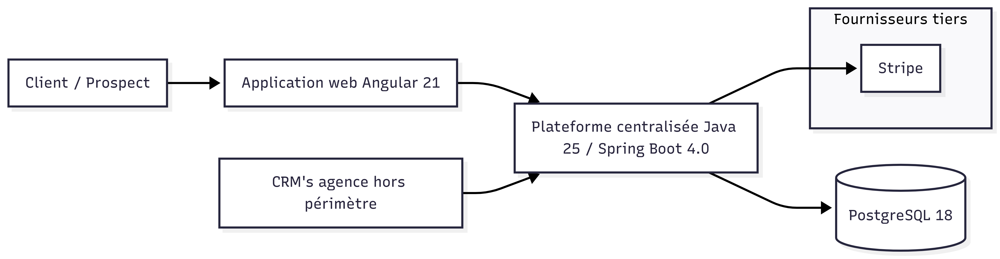
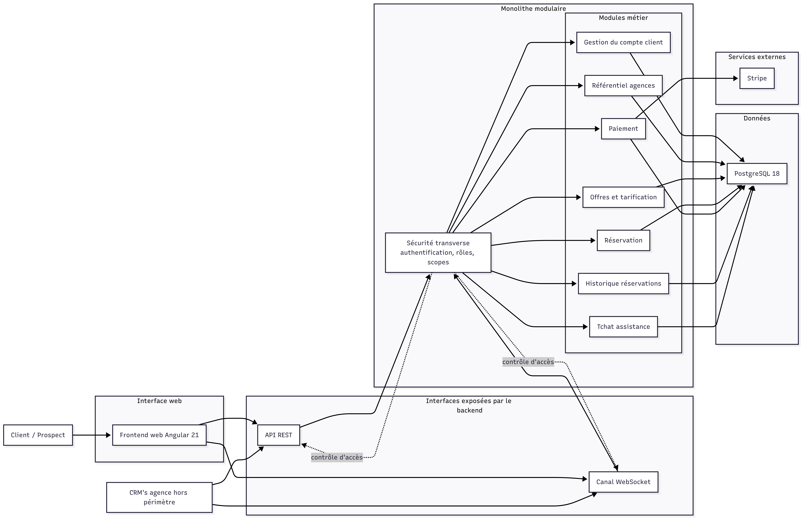
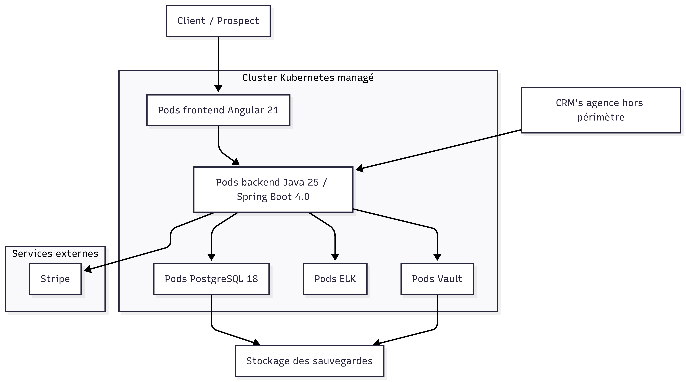
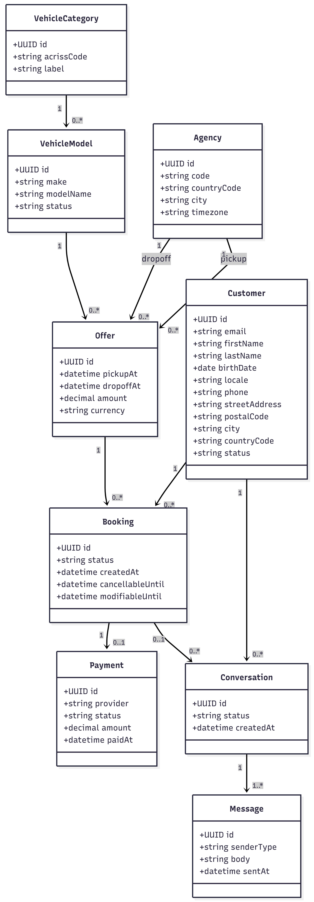
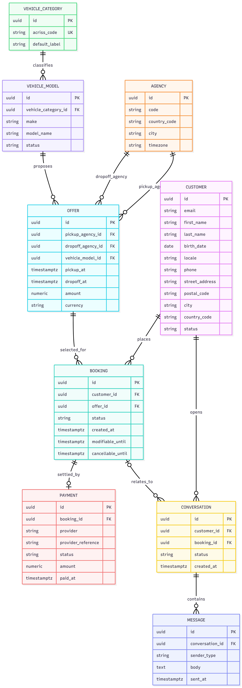
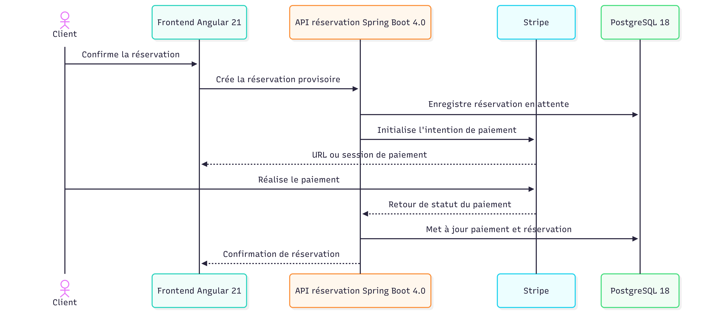
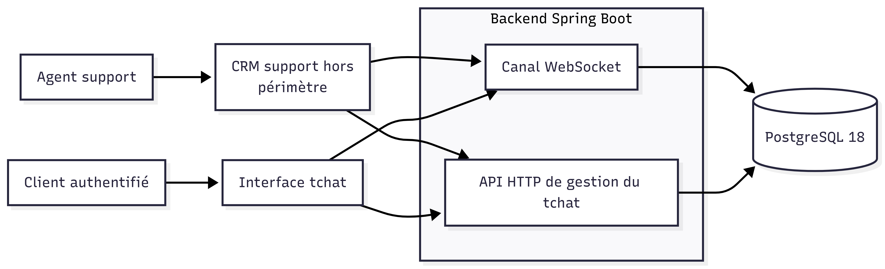

= Proposition d'architecture - Your Car Your Way
:toc:
:toclevels: 2
:sectnums:

== Objet du document

Ce document constitue le livrable de référence pour la proposition
d'architecture de Your Car Your Way.

Il rassemble les éléments d'analyse et de cadrage nécessaires à la refonte du
système d'information applicatif, en commençant par l'audit de
l'existant.

== Sources prises en compte

[cols="1,3", options="header"]
|===
| Source | Usage

| `consigne du projet`
| Cadrage global du projet et attentes client sur le livrable d'architecture.

| `Description technique de l'existant - Your Car Your Way`
| Source principale de l'audit technique de l'existant, incluant les architectures par pays, l'état des lieux sécurité, disponibilité et exploitation.

| `Cahier des charges livré`
| Référence fonctionnelle consolidée utilisée comme prérequis afin d'apprécier les limites de l'existant au regard du produit centralisé attendu.
|===

== Synthèse pour lecteur pressé

Le système d'information applicatif actuel de Your Car Your Way est fragmenté
entre plusieurs applications nationales, stacks techniques, hébergements et
modèles de données, ce qui ne permet pas de soutenir durablement l'objectif de
centralisation internationale du client.

L'audit met en évidence un portefeuille dominé par des monolithes hétérogènes,
des API limitées, des pratiques d'exploitation inégales, une posture de
sécurité insuffisamment homogène et une forte incertitude sur la convergence
des données. Les environnements les plus récents montrent néanmoins des
améliorations utiles en matière d'expérience utilisateur, de performance, de
disponibilité et de modernisation partielle de la stack.

La proposition d'architecture retenue consiste à mettre en place une
application web centralisée reposant sur un frontend unifié, un coeur métier en
monolithe modulaire, une API métier commune pour le web et les applications
d'agence, une base de données relationnelle centralisée et un composant dédié
au tchat temps réel. Cette cible privilégie une architecture proportionnée,
sécurisée, exploitable, accessible et compatible avec une migration progressive
par vagues.

== Audit de l'existant

=== Méthode d'audit

L'audit repose sur les principes suivants :

* s'appuyer uniquement sur les informations explicites fournies dans les
  documents disponibles ;
* distinguer les faits observables, leur analyse et les contraintes qui en
  découlent ;

Les critères d'analyse retenus sont les suivants :

* maintenabilité : capacité à comprendre, corriger et faire évoluer le système
  avec un effort raisonnable ;
* évolutivité : capacité à absorber de nouveaux besoins, pays, usages et
  intégrations sans divergence excessive ;
* performance et scalabilité : capacité à supporter la charge nominale et les
  pics saisonniers avec un niveau d'erreur acceptable ;
* disponibilité et résilience : capacité à limiter les interruptions et à
  restaurer rapidement le service ;
* sécurité : capacité à protéger les comptes, les secrets, les flux et les
  composants logiciels ;
* exploitation et delivery : capacité à déployer, observer, restaurer et opérer
  les applications de façon maîtrisée.

=== Vue d'ensemble du portefeuille applicatif

[cols="1,2,2,3", options="header"]
|===
| Zone | Stack principale | Hébergement | Constats

| France
| Java EE, JSP/JSF
| OVH
| Application historique, monolithe complet, base fonctionnelle riche mais vieillissante.

| Allemagne, Espagne, Italie
| Java EE dérivé du coeur FR
| OVH
| Code copié puis adapté localement, avec divergence progressive et variations de règles métier.

| Royaume-Uni
| PHP Laravel
| AWS EC2
| Application plus récente issue d'un rachat, isolée et différente sur le modèle de données et les règles de réservation.

| Canada
| React, Node.js
| AWS
| Expérience utilisateur meilleure, tentative locale de modernisation technique et visuelle, backend toujours monolithique.

| États-Unis
| Angular, Spring Boot
| Azure App Services / Containers
| Seule application conteneurisée, projet plus ambitieux mais non généralisé.
|===

=== Maintenabilité et évolutivité

==== Faits constatés

* Les applications ont été développées indépendamment, sans stratégie
  d'unification technique.
* Le socle France repose sur une base technique ancienne en Java EE avec
  frontend JSP/JSF.
* L'Allemagne, l'Espagne et l'Italie sont issues de dérivations du produit
  France, avec code copié puis adapté localement.
* Le Royaume-Uni, le Canada et les États-Unis utilisent chacun une stack
  distincte.
* L'architecture globale repose principalement sur des monolithes web.
* Les API sont limitées, hétérogènes et non unifiées.
* Des différences fonctionnelles existent déjà entre pays, notamment via des
  règles métier locales.

==== Analyse

La maintenabilité est dégradée par la coexistence de plusieurs piles
technologiques, qui multiplie les compétences à maintenir et complexifie la
gouvernance technique. Les dérivations de code par pays augmentent le risque de
divergence durable, de corrections non propagées et de régressions
fonctionnelles.

L'évolutivité du portefeuille est limitée pour les mêmes raisons. L'ajout d'un
besoin transverse ou international risque d'être interprété et implémenté
différemment selon les applications. La structure monolithique dominante
accroît la sensibilité aux changements : plusieurs domaines métier cohabitent
dans les mêmes applications, ce qui augmente le risque d'effets de bord lors
des évolutions.

==== Conclusion d'audit

Le portefeuille applicatif présente un niveau de maintenabilité et
d'évolutivité insuffisant pour soutenir durablement l'objectif de
centralisation internationale.

=== Performance, disponibilité et résilience

==== Faits constatés

* Charge maximale sans dégradation :
** FR/DE/ES/IT : environ 150 requêtes par seconde ;
** UK : environ 250 requêtes par seconde ;
** CA : environ 300 requêtes par seconde ;
** US : environ 350 requêtes par seconde.
* Taux d'erreur lors des pics saisonniers :
** FR/DE/ES/IT : jusqu'à 4 % ;
** UK/CA : 1,5 % ;
** US : 0,8 %.
* Taux de disponibilité moyen sur 12 mois :
** FR/DE/ES/IT : 97,2 % ;
** UK : 98,6 % ;
** CA : 98,1 % ;
** US : 98,9 %.
* MTTR :
** environ 2 h 45 sur OVH ;
** environ 1 h 10 sur AWS/Azure.
* Temps moyen d'indisponibilité mensuel :
** FR/DE/ES/IT : 21 à 28 minutes ;
** UK/CA : 9 à 16 minutes ;
** US : 7 minutes.
* Redondance :
** FR/DE/ES/IT : aucune réplication des instances applicatives ;
** UK/CA : réplication partielle ;
** US : application conteneurisée mais base non redondante.
* Sauvegardes :
** FR/DE/ES/IT : manuelles, quotidiennes, restauration non testée ;
** UK/CA : snapshots quotidiens AWS, sans tests réguliers ;
** US : sauvegardes Azure automatisées, test de restauration tous les 90 jours.

==== Analyse

Les applications les plus anciennes, hébergées sur OVH, présentent les
indicateurs les moins favorables en charge, en indisponibilité et en temps de
rétablissement. Les environnements cloud les plus récents obtiennent de
meilleurs résultats, ce qui confirme le bénéfice d'une modernisation partielle
de l'hébergement et de l'exploitation.

Ces progrès restent toutefois incomplets. La scalabilité demeure contrainte par
la structure monolithique, et la résilience reste insuffisante en raison d'une
redondance incomplète des composants applicatifs et de données. La maîtrise de
la restauration est également inégale : elle n'est pas testée sur le périmètre
OVH, peu vérifiée sur AWS et seulement périodique sur Azure.

==== Conclusion d'audit

Les niveaux de performance et de disponibilité sont hétérogènes. L'existant ne
présente pas une résilience homogène compatible avec un service centralisé
critique à l'échelle internationale.

=== Sécurité

==== Faits constatés

* Hashage des mots de passe :
** FR/DE/ES/IT : SHA-1 ;
** UK : bcrypt cost 10 ;
** CA : argon2id ;
** US : bcrypt strength 12.
* Chiffrement du trafic :
** HTTPS est activé partout ;
** TLS 1.0 est encore utilisé sur FR et IT pour compatibilité.
* Gestion des secrets :
** FR/DE/ES/IT : secrets stockés dans des fichiers de configuration sur serveur
   OVH ;
** UK/CA : variables d'environnement AWS, sans rotation automatisée ;
** US : Azure KeyVault utilisé partiellement, uniquement côté API.
* Dépendances présentant des vulnérabilités connues :
** FR : 41 % des packages ;
** DE/ES/IT : entre 35 % et 40 % ;
** UK : 18 % ;
** CA : 22 % ;
** US : 11 %.

==== Analyse

La posture de sécurité est très hétérogène. Certaines applications récentes
emploient des mécanismes plus robustes, mais plusieurs faiblesses critiques
restent présentes dans le portefeuille.

L'utilisation de SHA-1 pour les mots de passe sur FR/DE/ES/IT constitue une
faiblesse majeure de protection des comptes. Le maintien de TLS 1.0 sur FR et
IT dégrade le niveau de sécurité des échanges. Le stockage de secrets dans des
fichiers de configuration et l'absence de rotation automatisée sur une grande
partie du périmètre augmentent le risque de compromission. Enfin, la proportion
élevée de dépendances vulnérables sur plusieurs applications élargit la surface
d'exposition aux failles connues.

==== Conclusion d'audit

La posture de sécurité de l'existant est insuffisante et non homogène. En
l'état, elle ne répond pas au niveau d'exigence attendu pour un socle
international unifié.

=== Données et intégration

==== Faits constatés

* Chaque pays possède sa propre base de données.
* Les schémas de données sont divergents.
* Le partage d'information est inexistant ou repose sur des échanges manuels.
* Les API existantes sont limitées, hétérogènes et non unifiées.
* Le document source mentionne des différences fortes sur le modèle de données
  du Royaume-Uni, sans décrire précisément les schémas ou entités de chaque
  application.

==== Analyse

La fragmentation des bases ne permet pas d'assumer l'existence d'un référentiel
métier commun à l'échelle du groupe. Les échanges manuels et l'absence d'API
cohérentes traduisent un niveau d'intégration faible entre applications et avec
les systèmes d'agence.

Le principal point d'attention de cet audit porte sur les modèles de données.
Les sources confirment leur divergence, mais ne fournissent pas le niveau de
détail nécessaire pour apprécier les écarts sémantiques, la qualité des
données, les dépendances inter-applications ou les efforts de mapping.

==== Point d'incertitude majeur

Les différents modèles de données utilisés par les applications existantes ne
sont pas décrits précisément dans les sources disponibles. Il s'agit d'un point
d'incertitude important pour déterminer une stratégie de migration vers un
modèle de données unique. Avant toute décision de convergence, il est
nécessaire de qualifier les schémas réels, les écarts sémantiques, les règles
locales et les contraintes de reprise de données.

==== Conclusion d'audit

Le domaine des données constitue l'une des principales contraintes de
transformation. L'existant confirme une forte divergence, sans fournir encore
les éléments nécessaires pour arrêter une stratégie de migration.

=== Exploitation, accessibilité et écoconception

==== Faits constatés

* Déploiements manuels sur FR/DE/ES/IT.
* Taux de réussite des déploiements :
** FR/DE/ES/IT : 82 % ;
** UK/CA/US : 91 %.
* Délai moyen de stabilisation post-release :
** FR/DE/ES/IT : 3,4 jours ;
** UK/CA/US : 1,7 jour.
* Les pratiques d'hébergement et d'exploitation diffèrent fortement entre OVH,
  AWS et Azure.
* Aucune information explicite n'est fournie sur la conformité RGAA/WCAG, la
  navigation clavier, la compatibilité lecteurs d'écran ou d'éventuels audits
  d'accessibilité.
* Le Canada est le seul périmètre pour lequel une amélioration de l'expérience
  utilisateur est explicitement mentionnée.
* Aucun indicateur direct n'est fourni sur la sobriété numérique, les volumes
  de transfert, la consommation de ressources ou l'efficience applicative.

==== Analyse

Les pratiques d'exploitation sont trop hétérogènes pour soutenir un produit
unifié dans de bonnes conditions. Les déploiements manuels du périmètre OVH
augmentent le risque d'erreur humaine et réduisent la répétabilité des mises en
production. Les écarts de taux de réussite et de stabilisation après livraison
confirment une maîtrise opérationnelle plus faible sur ce socle.

Sur les exigences transverses, l'état de l'existant ne permet pas de démontrer
une conformité satisfaisante. Le niveau d'accessibilité n'est pas documenté, et
la seule amélioration UX explicitement mentionnée reste locale au Canada. De la
même manière, l'évaluation de l'écoconception ne peut être que qualitative,
faute de mesures explicites. La fragmentation technique actuelle limite
toutefois les gains potentiels de mutualisation et de rationalisation.

==== Conclusion d'audit

Les pratiques d'exploitation sont insuffisamment industrialisées, et
l'accessibilité comme l'écoconception ne sont pas documentées à un niveau
compatible avec les exigences du client.

=== Forces de l'existant

Les forces identifiées ci-dessous restent relatives et doivent être appréciées
dans le cadre des limites observées :

* la base historique France semble couvrir un périmètre fonctionnel riche ;
* plusieurs expérimentations plus récentes existent déjà dans le portefeuille :
  Laravel sur AWS, React/Node.js sur AWS, Angular/Spring Boot sur Azure ;
* les environnements cloud les plus récents présentent de meilleurs indicateurs
  de disponibilité, de charge et de stabilisation post-release ;
* l'application États-Unis introduit une première approche de conteneurisation ;
* l'application Canada traduit une amélioration de l'expérience utilisateur ;
* certaines briques de sécurité plus modernes existent déjà selon les pays,
  notamment argon2id au Canada et bcrypt renforcé aux États-Unis.

=== Faiblesses et risques majeurs

Les principaux risques mis en évidence par l'audit sont les suivants :

* fragmentation du portefeuille applicatif et absence de stratégie
  d'unification ;
* divergence du code, des règles métier et des stacks entre pays ;
* architecture dominante monolithique, peu favorable à une convergence
  progressive ;
* API limitées et hétérogènes ;
* divergence des schémas de données, sans description détaillée exploitable pour
  préparer sereinement la migration ;
* faiblesses critiques de sécurité sur plusieurs applications ;
* disponibilité et résilience insuffisantes, en particulier sur le périmètre
  OVH ;
* delivery trop manuel et trop peu industrialisé ;
* absence de démonstration sur l'accessibilité de l'existant ;
* manque de mesures explicites sur l'écoconception et l'usage réel des
  ressources.

=== Contraintes techniques de conception

L'audit fait apparaître les contraintes suivantes pour la conception de la
solution cible :

* traiter la coexistence de plusieurs stacks et de plusieurs environnements
  d'hébergement ;
* unifier des règles métier aujourd'hui divergentes selon les pays ;
* qualifier précisément les modèles de données réels avant toute stratégie de
  migration ou de centralisation ;
* relever le niveau minimal de sécurité sur l'ensemble du périmètre ;
* renforcer la résilience, la sauvegarde et la restaurabilité ;
* industrialiser le delivery et l'exploitation ;
* intégrer explicitement l'accessibilité, l'internationalisation et
  l'écoconception, qui ne sont pas démontrées dans l'existant.

=== Synthèse de l'audit

L'existant repose sur un portefeuille applicatif fragmenté, constitué d'un
socle historique en Java EE pour la France et ses dérivés, d'une application
Laravel au Royaume-Uni, d'une application React/Node.js au Canada et d'une
application Angular/Spring Boot aux États-Unis.

L'analyse met en évidence cinq constats structurants :

* la fragmentation technique est forte : stacks, hébergements, pratiques
  d'exploitation et règles métier diffèrent selon les pays ;
* l'architecture reste dominée par des monolithes web, avec des API limitées et
  hétérogènes ;
* les environnements les plus récents présentent de meilleurs résultats en
  performance et en disponibilité, sans pour autant éliminer les limites de
  résilience ;
* la sécurité n'est pas homogène et comporte plusieurs faiblesses explicites,
  dont SHA-1, TLS 1.0, une gestion incomplète des secrets et un niveau élevé de
  dépendances vulnérables sur plusieurs applications ;
* la question des données constitue le principal point de risque :
  chaque pays dispose de sa propre base avec des schémas divergents, mais les
  modèles de données existants ne sont pas décrits avec une précision
  suffisante pour définir une stratégie de migration unifiée.

L'existant apporte donc des bases fonctionnelles et quelques expérimentations
techniques utiles, mais il ne constitue pas en l'état un socle homogène,
maintenable, sécurisé et exploitable à l'échelle internationale.

=== Conclusion de l'audit

L'existant de Your Car Your Way montre que l'entreprise dispose de plusieurs
solutions opérationnelles ayant évolué localement, mais pas d'un socle
technique unifié, maintenable et suffisamment maîtrisé pour porter seul la
centralisation attendue.

Les environnements les plus récents démontrent des améliorations ponctuelles en
matière d'expérience utilisateur, de sécurité, de disponibilité et de
performance, mais ces progrès restent dispersés et incomplets.

Le risque principal porte sur la convergence des données : les
schémas sont annoncés comme divergents, mais leur description précise manque
dans les sources. Cette incertitude doit être considérée comme structurante pour
la stratégie de migration vers un modèle de données unique.

== Architecture cible

=== Objet de la cible

L'architecture cible proposée vise à fournir une application web centralisée,
internationale et exploitable, capable d'unifier les parcours client, les
règles métier communes et l'intégration des applications d'agence, tout en
réduisant la fragmentation observée dans l'existant.

La cible répond aux exigences structurantes suivantes :

* disposer d'un socle unique pour la recherche d'offres, la réservation, le
  paiement, le suivi des réservations et l'assistance par tchat ;
* exposer une API métier pour les applications d'agence ;
* centraliser les données métier de référence, avec un modèle commun harmonisé ;
* intégrer nativement la sécurité, l'accessibilité, l'internationalisation,
  l'observabilité et l'écoconception ;
* permettre une trajectoire de migration progressive depuis les applications
  existantes, sans supposer une bascule brutale.

=== Principes d'architecture

Les choix proposés reposent sur les principes suivants :

* *centralisation fonctionnelle avec modularité interne* : la cible doit être
  un produit unique, mais découplé par domaines métier afin de limiter les
  effets de bord ;
* *API-first* : les parcours web et les applications d'agence consomment le
  même socle de services via des contrats d'API documentés ;
* *cloud native adapté au besoin réel* : la solution doit être industrialisable,
  observable et résiliente, sans tomber dans un découpage microservices trop
  coûteux pour le périmètre et la maturité actuelle ;
* *sécurité et conformité dès la conception* : les choix techniques doivent
  relever le niveau minimal sur l'ensemble du périmètre, notamment sur la
  gestion des secrets, l'authentification et les habilitations, la
  journalisation sécurisée et la protection des échanges entre composants et
  avec les services tiers ;
* *données communes, règles locales paramétrables* : le modèle central doit
  porter les invariants métier du groupe et laisser les spécificités locales à
  de la configuration maîtrisée ; lorsque des exigences métiers imposent
  un comportement réellement distinct, elles doivent être isolées dans des
  composants métier dédiés à la fonctionnalité concernée ;
* *coexistence et migration incrémentale* : les applications historiques et les
  systèmes d'agence doivent pouvoir coexister temporairement avec la cible.

=== Hypothèses de cadrage

==== Faits pris en compte

* Le besoin prioritaire du client est une application centralisée unique pour
  plusieurs pays.
* Les applications d'agence doivent consommer une API métier avec des
  opérations CRUD par domaine.
* Le paiement doit rester externalisé.
* Le tchat doit être traité comme une fonctionnalité représentative d'une PoC.
* L'audit confirme une forte divergence des stacks, des pratiques
  d'exploitation et des schémas de données.

==== Hypothèses de travail

* Les règles communes peuvent être normalisées à l'échelle du
  groupe, tandis que les écarts pays relèvent de paramètres et
  de règles métiers spécifiques.
* La reprise de données devra être menée par étapes, pays par pays, après
  étude et cadrage détaillée des schémas de données existants.
* Les outils d'agence ne seront pas tous remplacés immédiatement ; certains
  consommeront la nouvelle API avant leur refonte propre.

=== Exigences et spécifications techniques

==== Exigences non fonctionnelles cibles

[cols="1,3", options="header"]
|===
| Domaine | Spécification cible

| Disponibilité
| Objectif de disponibilité mensuelle de 99,9 % sur le périmètre applicatif
  client et API, hors indisponibilité planifiée.

| Performance
| L'API doit répondre en moins de 300 ms, hors dépendance à un service externe.

| Scalabilité
| L'architecture doit pouvoir absorber une augmentation de charge, notamment
  lors des pics d'activité saisonniers, sans dégradation majeure du service.

| Sécurité
| TLS moderne, gestion centralisée des secrets, contrôle d'accès par rôles,
  journalisation sécurisée, chiffrement des données sensibles stockées lorsque
  pertinent, hashage robuste des mots de passe.

| Maintenabilité
| Base de code unique, conventions communes, séparation nette des domaines,
  tests automatisés par couche et pipeline CI/CD standardisé.

| Accessibilité
| Conception alignée avec WCAG 2.2 AA et RGAA, avec exigences vérifiables sur
  navigation clavier, sémantique, contrastes et gestion des erreurs.

| Internationalisation
| Localisation des contenus, gestion explicite des langues, devises, fuseaux
  horaires, formats de date, adresse et téléphone.

| Exploitation
| Logs structurés centralisés, tableaux de bord d'exploitation, alertes automatiques,
  sauvegardes automatisées et tests réguliers de restauration.

| Écoconception
| Conception sobre des parcours, limitation des données échangées au strict nécessaire, mise en      cache limitée aux données stables fréquemment consultées, pagination systématique et limitations des dépendances non essentielles.
|===

==== Domaines métier

Le coeur applicatif est organisé autour des domaines métiers suivants :

* *gestion du compte client* ;
* *référentiel agences* ;
* *catalogue d'offres et tarification* ;
* *réservation* ;
* *paiement* ;
* *historique et cycle de vie des réservations* ;
* *tchat d'assistance* ;

=== Options d'architecture envisagées

[cols="1,2,2,2,2", options="header"]
|===
| Option | Synthèse | Atouts | Limites | Décision

| Conserver et moderniser les applications existantes
| Conserver les applications existantes et leurs stacks respectives, les moderniser localement et les faire interagir via des API, tout en maintenant des bases de données distinctes.
| Effort de transformation initial plus progressif, avec réutilisation maximale de l’existant.
| Ne règle pas la fragmentation structurelle, complique la gouvernance globale, et maintient durablement des divergences techniques et fonctionnelles.
| Écartée.

| Microservices complets par domaine
| Un système découpé en plusieurs services autonomes, chacun responsable d'un
  domaine métier distinct.
| Découplage métier fort, meilleure isolation des évolutions, limitation des effets de bord, montée en charge ciblée par domaine.
| Surcharge de complexité, coûts d'exploitation, de sécurité et d'observabilité plus élevés :
  plus de documentation, de surveillance, de configuration, de déploiements et de gestion d'infrastructure, plus gros efforts de coordination entre équipes.
| Écartée à ce stade car trop complexe pour les contraintes actuelles.

| Monolithe modulaire évolutif
| Une application centrale unique, organisée en modules métier internes séparés, permettant si la complexité le justifie à terme, une extraction progressive de certains domaines en services distincts.
| Bon compromis entre centralisation, maintenabilité, vitesse de livraison et
  maîtrise opérationnelle ; facilite l'exposition d'API cohérentes.
| Demande une discipline d'architecture interne pour éviter la dérive vers un
  monolithe couplé.
| Retenue.
|===

La solution retenue est un *monolithe modulaire évolutif*, structuré par domaines métier afin de limiter les effets de bord, tout en permettant, si la complexité augmente à terme, l’extraction progressive de certains domaines en micro-services distincts.

=== Architecture retenue et décisions structurantes

Au regard des besoins métiers consolidés, des contraintes d'intégration, de
coexistence et de la comparaison des options étudiées, les décisions
structurantes suivantes sont retenues :

* retenir un *monolithe modulaire évolutif* pour le coeur métier central ;
* exposer le système au travers d'une *API REST sécurisée et documentée* ;
* centraliser les données dans une *base relationnelle unique* ;
* intégrer le tchat comme un *module dédié du backend*, utilisant des
  WebSockets ;
* prévoir des *traitements asynchrone* pour certaines actions secondaires afin
  de ne pas ralentir les parcours clés ;
* héberger la solution sur une *plateforme cloud conteneurisée unique*, avec un
  cluster Kubernetes managé et des composants applicatifs, de données et
  d'observabilité exploités par l'entreprise ;
* déployer le coffre-fort de secrets comme un composant dédié dans Kubernetes,
  avec persistance et sauvegarde maîtrisées par l'entreprise.

=== Choix technologiques

[cols="1,2,3", options="header"]
|===
| Domaine | Choix recommandé | Justification

| Frontend web
| Angular 21
| Cadre frontend imposé, robuste et adapté à la structuration d'une application
  métier internationale avec exigences d'accessibilité, de maintenabilité et de
  cohérence d'interface.

| Backend coeur métier
| Java 25 LTS, Spring Boot 4.0 et Maven
| Stack robuste, mature, bien adaptée aux traitements transactionnels, à la
  sécurité, à la documentation d'API et à l'industrialisation ; le choix
  capitalise sur les connaissances Java de l'entreprise tout en modernisant le
  socle technique.

| API
| REST JSON documentée via OpenAPI
| Repose sur des standards qui facilitent la normalisation des échanges, l'application de conventions communes et la documentation structurée des contrats API.

| Base de données
| PostgreSQL 18
| Base relationnelle mature, adaptée aux transactions, aux
  contraintes d'intégrité et aux requêtes riches.

| Tchat temps réel
| WebSocket sécurisé dans un module dédié du backend Spring Boot
| Répond au besoin temps réel de la PoC tout en restant cohérent avec le socle backend retenu.

| Authentification
| OAuth côté Java via Spring Security
| Permet de sécuriser les API et les parcours authentifiés, tout en gérant de
  manière cohérente les rôles client et agence.

| Paiement
| Stripe (SDK java officiel + Stripe.js)
| Conforme au besoin d'externalisation, réduit les contraintes de sécurité et
  de conformité liées au traitement des données de carte bancaire et fournit
  une intégration standardisée pour le paiement en ligne.

| Déploiement
| Conteneurs sur Kubernetes managé
| Fournit un socle d'orchestration standardisé tout en laissant à l'entreprise
  la maîtrise de l'exploitation de ses conteneurs applicatifs, de données et
  d'observabilité, y compris le coffre-fort de secrets déployé dans le
  cluster.

| Observabilité
| ELK : Elasticsearch, Logstash, Kibana
| Fournit une centralisation des logs, une capacité d'investigation et des
  tableaux de bord opérationnels adaptés à l'exploitation du produit.
|===

=== Vue de contexte

Ce diagramme présente les principaux acteurs et systèmes en interaction avec la
plateforme centralisée : clients, applications d'agence, backend, base de
données et prestataire de paiement.

=== Vue de composants

Ce diagramme montre le découpage fonctionnel de l'application entre interfaces
exposées, sécurité transverse, modules métier, base de données et service de
paiement externe.

=== Vue de déploiement

Ce diagramme illustre l'implantation cible des composants sur une plateforme
conteneurisée, avec séparation des pods frontend, backend, base de données et
observabilité. Il met aussi en évidence que seul Kubernetes est managé, tandis
que les autres composants, y compris Vault, restent exploités par l'entreprise.

=== Architecture applicative cible

==== Vue d'ensemble

La cible repose sur un frontend web unifié et un backend métier centralisé.

Le coeur métier gère les entités
structurantes du domaine : compte client, agence, catégorie ACRISS, modèle de
véhicule, offre, réservation, paiement, historique et tchat. Ce coeur est exposé via une API REST
versionnée, utilisée à la fois par le frontend et par les applications
d'agence.

Les applications d'agence n'introduisent pas de module métier dédié. Elles
consomment les mêmes domaines fonctionnels que le frontend web via l'API REST,
avec des contrôles transverses d'authentification, de rôles, de scopes et de
traçabilité adaptés à leur profil technique.

==== Découpage logique du coeur métier

[cols="1,3", options="header"]
|===
| Module ou capacité transverse | Responsabilité

| Gestion du compte client
| Création de compte, consultation du profil, mise à jour des informations
  personnelles, suppression du compte et gestion de l'état du compte client.

| Sécurité
| Authentification des clients et des applications d'agence, contrôle d'accès
  par rôles et scopes, gestion des sessions et traçabilité des accès.

| Agences
| Référentiel des agences, localisation, informations d'exploitation,
  disponibilité d'ouverture et paramètres utiles à la réservation.

| Offres et tarification
| Recherche d'offres, exposition des catégories ACRISS et des modèles de
  véhicule, calculs tarifaires, règles de filtrage et de présentation des
  disponibilités.

| Réservation
| Création, validation, verrouillage fonctionnel, cycle de vie et application
  des règles de modification, d'annulation et de remboursement.

| Paiement
| Initialisation de transaction auprès de Stripe, réception des retours,
  rapprochement avec la réservation et conservation des traces utiles.

| Historique
| Consultation des réservations passées, courantes, modifiables ou annulables.

| Tchat
| Gestion des conversations, participants, messages, statuts de lecture et
  règles d'accès liées à l'assistance.

| Paramétrage pays
| Gestion des langues activées, devises, textes localisés, règles locales
  configurables, paramètres d'affichage et résolution encadrée des exceptions
  métier locales lorsque le paramétrage seul ne suffit pas.
|===

==== Gestion des variantes locales complexes

Le paramétrage doit rester le mécanisme par défaut pour les différences locales
prévisibles, par exemple les langues, devises, textes réglementaires, etc.

Lorsque la réglementation d'un pays impose une logique métier réellement
différente, qui ne peut pas être traitée proprement par de simples paramètres, la cible doit permettre, dans quelques
modules métier identifiés, l’usage de points d’extension techniques reposant
sur des interfaces de service.

Le principe retenu est le suivant :

* une implémentation standard couvre le comportement commun ;
* des implémentations spécifiques peuvent être ajoutées uniquement pour les cas
  réellement nécessaires ;
* le choix de l’implémentation active dépend du pays et du cas d’usage ;
* cette logique reste confinée au module concerné, afin d’éviter la
  multiplication de conditions pays dans l’ensemble du code.

Cette approche permet de conserver un socle commun tout en traitant proprement
les écarts locaux sans recréer une application distincte par pays.

=== Modèle de données cible

==== Principes

Le modèle de données cible est centré sur un référentiel groupe unique. Il
porte les invariants métier communs, tandis que les variations locales sont
traitées par paramétrage.

Les règles suivantes s'appliquent :

* les identifiants techniques sont globaux et non spécifiques à un pays ;
* les dates métier sont stockées en UTC, avec fuseau de restitution explicite ;
* les données sont stockées dans un format commun, puis adaptées à la langue et au contexte de l’utilisateur au moment de l’affichage;
* le profil client inclut a minima les informations attendues par le besoin
  fonctionnel : email, nom, prénom, date de naissance, téléphone, adresse et
  statut de compte ;
* les codes ACRISS restent la référence de classification, avec libellés
  compréhensibles et localisés, mais les offres sont rattachées à un modèle de
  véhicule afin de pouvoir faire évoluer l'offre au-delà de la seule catégorie ;
* les données métier sont stockées séparément des données techniques de
  journalisation, d'historique d'actions et de traces d'échanges avec les
  services externes, qui sont portées par les logs structurés centralisés dans
  ELK.

==== Diagramme de domaine

Ce diagramme représente les principales entités métier et leurs relations, avec
une distinction entre compte client, classification ACRISS, modèles de
véhicules, offres, réservations, paiements et tchat.

==== Modèle logique de données

Ce diagramme traduit les entités métier en structures de données relationnelles
et met en évidence les clés et dépendances principales du schéma cible.

=== Intégration des composants tiers et services transverses

==== Paiement en ligne

Stripe reste externe au coeur métier. Le système central :

* crée une intention de paiement liée à la réservation ;
* redirige ou embarque le parcours vers Stripe selon l'expérience retenue ;
* reçoit un retour signé du prestataire ;
* rapproche le statut de paiement avec la réservation ;
* journalise l'événement de paiement sans stocker de données carte sensibles.

Le diagramme de séquence associé illustre l'enchaînement entre le frontend,
l'API de réservation, la base de données et Stripe jusqu'à la confirmation de
la réservation.

==== Applications d'agence

Les applications d'agence (hors périmètre) consomment une API sécurisée, versionnée et
documentée. Les domaines exposés comprennent a minima :

* clients ;
* agences ;
* offres ;
* réservations ;
* paiements en consultation ;
* conversations de tchat.

Les opérations CRUD standard sont exposées pour les domaines où elles sont
fonctionnellement légitimes, notamment clients, agences et réservations. Le
domaine paiement reste limité à des opérations de consultation et de
rapprochement, l'exécution de la transaction demeurant externalisée chez le
prestataire.

L'exposition de ces domaines ne repose pas sur un module métier spécifique.
Elle s'appuie sur le même coeur applicatif que le frontend web, avec un
mécanisme transverse d'authentification et de gestion des droits assurant :

* l'authentification technique des applications d'agence ;
* l'application de rôles et scopes par domaine exposé ;
* la traçabilité des accès via des logs structurés centralisés dans ELK ;

==== Notifications transactionnelles

Aucun composant tiers dédié aux notifications email ou SMS n'est retenu à ce
stade dans la cible, faute d'exigence explicite dans les besoins sources.
L'architecture laisse néanmoins la possibilité d'ajouter ultérieurement un
prestataire de notification si la confirmation de réservation, les rappels ou
les messages de service doivent être externalisés.

==== Authentification OAuth

L'application met en oeuvre OAuth côté Java via Spring Security pour gérer :

* l'authentification des clients ;
* l'authentification technique des applications d'agence ;
* les jetons d'accès et de rafraîchissement ;
* les politiques de mot de passe et rotation de session.

=== Architecture du tchat

Le tchat est retenu comme fonctionnalité représentative de la future PoC car il
permet de valider un échange temps réel entre client et conseiller au travers
d'un canal WebSocket.

La cible d'architecture prévoit à terme l'intégration de ce tchat avec les
mécanismes d'authentification, de gestion des accès, de persistance et
d'observabilité de la plateforme. Toutefois, afin de conserver une PoC
proportionnée au périmètre du projet, ces aspects ne sont pas implémentés dans
le prototype.

Le périmètre fonctionnel proposé pour la PoC tchat est volontairement limité :

* ouverture d'une conversation ;
* échange de messages en temps réel via WebSocket ;
* affichage chronologique des messages ;
* simulation d'un conseiller via un outil hors périmètre ou un client technique
  simple.

La PoC vise uniquement à démontrer la faisabilité du canal temps réel. Elle ne
constitue pas une implémentation complète du tchat cible.

Le diagramme ci-dessous présente les échanges minimaux entre l'interface tchat,
le backend temps réel et l'outil utilisé pour simuler le conseiller.

=== Sécurité

Les mesures de sécurité suivantes sont requises dans la cible :

* arrêt de TLS 1.0 et généralisation de TLS 1.2 minimum, avec préférence pour
  TLS 1.3 ;
* centralisation des secrets dans un coffre-fort dédié (vault) déployé dans le cluster,
  avec rotation planifiée, persistance et sauvegarde ;
* hashage des mots de passe via Argon2id ;
* authentification OAuth côté Java avec séparation des rôles client et agence ;
* validation stricte des entrées côté API ;
* journalisation des événements dans des logs structurés centralisés
  dans ELK, avec masquage des données à caractère personnel ;
* chiffrement des sauvegardes et contrôle d'accès minimal sur les données (principe de moindre privilège) ;
* la chaîne CI/CD exécute automatiquement des analyses de sécurité du code, des dépendances et des images conteneur avant livraison ;
* politique de dépendances maintenues et pilotées par niveau de criticité.

=== Accessibilité, internationalisation et écoconception

==== Accessibilité

L'accessibilité doit être traitée comme une contrainte de conception de la
cible, et non comme une correction a posteriori. Cela implique les choix
structurants suivants :

* mise en place d'un socle d'interface mutualisé intégrant des composants
  accessibles par défaut pour les formulaires, modales, messages d'erreur,
  tableaux, navigation et parcours transactionnels ;
* priorité donnée à une structure HTML adaptée avec la navigation clavier et les lecteurs
  d'écran ;
* usage d'ARIA limité aux cas où le HTML natif ne suffit pas, afin d'éviter des composants artificiellement accessibles mais fragiles ;
* intégration de contrôles d'accessibilité dans la chaîne de delivery, via
  tests automatisés ciblés et revues manuelles sur les parcours critiques :
  recherche, réservation, paiement, authentification et tchat ;
* définition de règles de conception partagées pour les contrastes, la gestion
  du focus, les messages d'erreur, les confirmations et les changements d'état
  dynamiques ;

==== Internationalisation

L'internationalisation doit être portée par l'architecture de la cible afin
d'éviter une nouvelle fragmentation par pays. Cela implique les décisions
suivantes :

* séparation claire entre le coeur métier commun, les contenus localisés et les
  paramètres configurables par pays ;
* gestion explicite des langues, devises, fuseaux horaires et formats
  internationaux dans les contrats d'API, le modèle de données et les
  composants d'interface ;
* conservation d'un référentiel commun pour les dates, heures et montants,
  avec formatage adapté uniquement à l'affichage ou aux échanges externes ;
* si une différence locale est prévue et acceptable dans la cible, elle doit être portée par la configuration ou un mécanisme d’extension maîtrisé, pas par une nouvelle branche du coeur métier commun ;
* prise en compte dès la conception des contraintes d'intégration liées aux
  adresses, numéros de téléphone, taxes, moyens de paiement et règlementation
  selon le pays.

==== Écoconception

L'écoconception doit se traduire par des choix d'architecture proportionnés,
afin de limiter durablement la consommation de ressources côté frontend,
backend et infrastructure. Cela implique :

* une architecture applicative resserrée, avec un nombre limité de composants
  spécialisés au strict besoin du produit cible ;
* des contrats d'API conçus pour limiter les volumes échangés, éviter les
  surcharges de données et favoriser la pagination sur les listes métier ;
* une stratégie de cache ciblée sur les données stables ou de consultation
  fréquente, sans multiplier les couches de mise en cache difficiles à
  exploiter ;
* une gouvernance des dépendances frontend et backend visant à contenir la
  complexité technique et le poids des artefacts livrés ;
* une observabilité dimensionnée au besoin d'exploitation, afin d'éviter la
  surproduction de logs, métriques et traces peu utiles ;
* une gestion maîtrisée des environnements hors production, avec extinction ou
  réduction des ressources non utilisées.

=== Exploitation et qualité de livraison

==== Chaîne de livraison cible

La chaîne de delivery doit inclure :

* contrôle qualité sur chaque merge request ;
* exécution des tests unitaires, d'intégration et de contrat ;
* scans de sécurité automatisés ;
* construction d'images conteneur signées ;
* publication des images dans un registre, avec conservation des
  versions, des signatures et des métadonnées nécessaires au rollback ;
* déploiement automatisé en environnements dev, recette puis production ;
* mécanisme documenté de retour arrière permettant de redéployer rapidement la
  dernière version stable de l'application et de ses configurations.

==== Observabilité

L'exploitation cible comprend :

* journaux structurés corrélables par identifiant de requête ;
* centralisation des logs dans ELK ;
* traçabilité des accès et des actions techniques via ces logs centralisés ;
* tableaux de bord Kibana dédiés au parcours de réservation, au paiement et au
  tchat ;
* alertes sur disponibilité, latence, erreurs applicatives, files d'attente et
  incidents de paiement.

==== Sauvegardes et continuité

Les sauvegardes doivent être :

* automatisées ;
* chiffrées ;
* stockées sur un périmètre d'infrastructure distinct de la production, afin
  qu'un incident affectant l'environnement principal n'empêche pas la
  restauration ;
* testées régulièrement par exercice de restauration ;
* définies avec des objectifs de reprise explicites en matière de perte de
  données acceptable et de délai de restauration, une attention particulière doit être portée aux données de réservation et de paiement ;
* couvrir la base de données PostgreSQL comme le stockage du coffre-fort de
  secrets.

=== Stratégie de migration et de coexistence

Compte tenu de l'incertitude documentée sur les schémas sources, la migration
doit être progressive.

La trajectoire recommandée est la suivante :

. qualifier les modèles de données réels pays par pays ;
. construire le modèle de données commun et les règles de correspondance entre
  les données sources de chaque pays et le modèle cible ;
. ouvrir la nouvelle API pour les usages d'agence prioritaires ;
. migrer d'abord un périmètre fonctionnel limité, puis les autres domaines ;
. basculer les pays par vagues, avec coexistence temporaire et synchronisations
  contrôlées si nécessaire ;
. retirer les applications historiques une fois la stabilité constatée.

Cette approche réduit le risque de rupture opérationnelle et permet d'apprendre
sur la qualité réelle des données avant généralisation.

=== Limites, risques résiduels et recommandations

==== Limites connues

* Les sources disponibles ne décrivent pas précisément les schémas de données
  existants.
* Les règles métier locales par pays ne sont pas toutes détaillées.
* Les modalités exactes de mise en oeuvre d'OAuth restent à préciser selon les
  contraintes de sécurité et d'exploitation retenues.

==== Risques résiduels

* sous-estimation de l'effort de migration de données ;
* reconstitution tardive de règles locales aujourd'hui implicites dans les
  applications pays ;
* risque de perte progressive de la séparation entre domaines métier, pouvant transformer le monolithe modulaire en bloc fortement couplé et plus difficile à faire évoluer ;
* adopter Kubernetes sans cadre commun d’exploitation peut créer une charge opérationnelle disproportionnée par rapport au besoin réel.

==== Recommandations complémentaires

* lancer rapidement un chantier de cartographie détaillée des schémas de données
  existants ;
* formaliser un dictionnaire de données métier groupe ;
* définir une gouvernance d'API et de versionnement dès le démarrage ;
* préparer un référentiel de paramètres pays pour éviter toute redérivation du
  code ;

== Conclusion de la proposition

La proposition retenue repose sur une architecture centralisée, modulaire et
proportionnée, conçue pour remplacer progressivement les applications web
nationales actuelles par un produit unique sans reproduire la fragmentation
technique et fonctionnelle constatée dans l'existant.

La cible s'appuie sur un frontend web unifié, un coeur métier central en
monolithe modulaire, une API métier commune pour le web et les applications
d'agence, une base de données relationnelle centralisée, un tchat intégré au
backend via un module dédié et des composants transverses d'exploitation, de
sécurité et d'observabilité industrialisés.

Ce choix est cohérent avec les besoins consolidés et avec les conclusions de
l'audit : il répond à l'objectif de centralisation, permet de traiter les
spécificités pays par paramétrage ou extensions encadrées, conserve une
trajectoire de migration par vagues et évite, à ce stade, la complexité
disproportionnée d'une architecture en microservices complets.

La proposition n'est toutefois robuste que sous certaines conditions :

* qualification détaillée des schémas sources et préparation des règles de
  correspondance de données avant généralisation de la migration ;
* gouvernance effective des frontières entre domaines métier pour éviter la
  dérive du monolithe modulaire ;
* cadre d'exploitation et standards d'équipe suffisants pour maîtriser la
  plateforme Kubernetes, la chaîne CI/CD, les sauvegardes et l'observabilité ;

Sous ces réserves, cette architecture constitue une base crédible pour engager
la suite du programme et cadrer une PoC tchat limitée, cohérente avec la cible
documentée.
