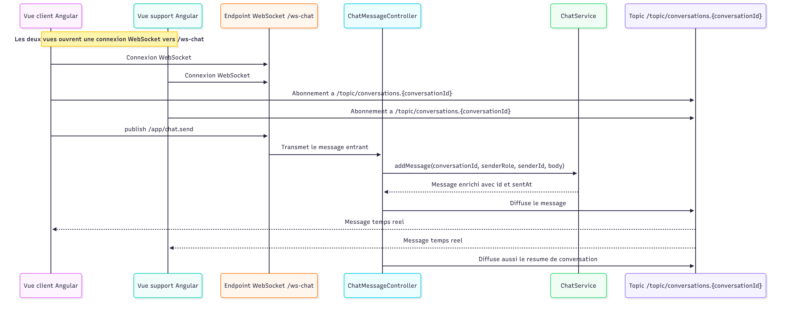

# PoC tchat - Your Car Your Way

Cette PoC démontre un échange temps réel minimal entre un client simulé et un support simulé avec une stack `Angular + Spring Boot` et un canal `WebSocket`.

Le périmètre est volontairement limité :
- une page unique divisée en deux vues ;
- création de faux utilisateurs côté client ;
- une conversation unique par utilisateur ;
- messages temps réel côté client et côté support ;
- données stockées en mémoire côté backend ;
- pas d'authentification, pas de base de données, pas de sécurité avancée.

## Structure du projet

- `backend/` : API Spring Boot, endpoints REST d'initialisation et WebSocket STOMP.
- `frontend/` : interface Angular avec vue client à gauche et vue support à droite.

## Prérequis

- Java 21
- Maven 3.8+
- Node.js 22+
- npm 11+

## Lancement

### 1. Démarrer le backend

```bash
cd poc-chat/backend
mvn spring-boot:run
```

Backend disponible sur `http://localhost:8080`.

### 2. Installer les dépendances frontend

```bash
cd poc-chat/frontend
npm install
```

### 3. Démarrer le frontend

```bash
cd poc-chat/frontend
npm start
```

Frontend disponible sur `http://localhost:4200`.

## Scénario de démonstration

1. Ouvrir l'application web.
2. Cliquer sur `Créer un utilisateur`.
3. Envoyer un message dans la colonne de gauche.
4. Vérifier que le support voit la conversation à droite.
5. Répondre depuis la colonne de droite.
6. Changer de conversation côté support si plusieurs utilisateurs ont été créés.

## Comprendre rapidement le projet

### Vue d'ensemble du flux WebSocket



Le point important à comprendre est le suivant :
- le frontend n'envoie pas les messages en HTTP ;
- il ouvre une connexion WebSocket vers le backend ;
- ensuite il envoie les messages sur un canal d'entrée ;
- le backend reçoit le message, le stocke en mémoire, puis le rediffuse ;
- toutes les vues abonnées à la conversation reçoivent le nouveau message immédiatement.

En pratique, le flux est celui-ci :
1. la vue Angular ouvre une connexion vers `/ws-chat` ;
2. elle s'abonne au topic de la conversation active ;
3. quand un utilisateur clique sur `Envoyer`, le frontend publie le message vers `/app/chat.send` ;
4. Spring reçoit ce message dans le contrôleur WebSocket ;
5. le service métier ajoute le message à la conversation en mémoire ;
6. Spring republie le message sur `/topic/conversations.{conversationId}` ;
7. les panneaux client et support affichent le message sans rechargement.

### Par où commencer quand on découvre le code

Si vous etes junior, lisez les fichiers dans cet ordre :
1. [README.md](README.md) pour comprendre le périmètre de la PoC.
2. [frontend/src/app/app.html](frontend/src/app/app.html) pour voir l'interface et les deux colonnes.
3. [frontend/src/app/app.ts](frontend/src/app/app.ts) pour voir comment la page charge les données, sélectionne les conversations et envoie les messages.
4. [frontend/src/app/chat-socket.service.ts](frontend/src/app/chat-socket.service.ts) pour comprendre la connexion WebSocket côté Angular.
5. [backend/src/main/java/com/ycyw/chat/config/WebSocketConfig.java](backend/src/main/java/com/ycyw/chat/config/WebSocketConfig.java) pour voir la configuration WebSocket côté Spring.
6. [backend/src/main/java/com/ycyw/chat/api/ChatMessageController.java](backend/src/main/java/com/ycyw/chat/api/ChatMessageController.java) pour voir où arrivent les messages envoyés par le frontend.
7. [backend/src/main/java/com/ycyw/chat/service/ChatService.java](backend/src/main/java/com/ycyw/chat/service/ChatService.java) pour comprendre où sont stockés les utilisateurs, conversations et messages.

### Ce que fait chaque fichier principal

- `frontend/src/app/app.html` : structure visuelle de la page, avec le panneau client à gauche et le panneau support à droite.
- `frontend/src/app/app.ts` : logique d'écran, chargement initial, sélection d'utilisateur, sélection de conversation et réaction aux messages entrants.
- `frontend/src/app/chat-api.service.ts` : appels HTTP simples pour récupérer les utilisateurs, conversations et messages existants.
- `frontend/src/app/chat-socket.service.ts` : connexion WebSocket, abonnements aux conversations et publication des messages.
- `backend/.../WebSocketConfig.java` : déclare l'endpoint `/ws-chat`, le préfixe d'entrée `/app` et le broker simple `/topic`.
- `backend/.../ChatMessageController.java` : reçoit les messages envoyés par Angular et les rediffuse.
- `backend/.../ChatService.java` : stocke tout en mémoire avec des `Map` Java. Si le backend redémarre, tout est perdu.

### Le vocabulaire minimum à retenir

- `endpoint WebSocket` : l'adresse de connexion temps réel. Ici : `/ws-chat`.
- `publish` : envoyer un message au backend.
- `topic` : canal de diffusion auquel plusieurs écrans peuvent s'abonner.
- `subscribe` : écouter un topic pour recevoir les nouveaux messages.
- `STOMP` : protocole de messagerie utilisé au-dessus de WebSocket pour structurer les échanges.

### Ce qu'il faut modifier si vous voulez faire évoluer la PoC

- changer l'interface : commencer par `frontend/src/app/app.html` et `app.css` ;
- changer le comportement des messages : regarder `frontend/src/app/app.ts` et `chat-socket.service.ts` ;
- changer la logique métier ou la structure mémoire : regarder `ChatService.java` ;
- changer les destinations WebSocket : regarder `WebSocketConfig.java`, `ChatMessageController.java` et `chat-socket.service.ts` ensemble.

## Contrats exposés

### HTTP

- `POST /api/demo-users` : crée un utilisateur simulé et sa conversation.
- `GET /api/demo-users` : liste les utilisateurs simulés.
- `GET /api/conversations` : liste les conversations.
- `GET /api/conversations/{conversationId}/messages` : liste les messages d'une conversation.

### WebSocket

- endpoint : `/ws-chat`
- destination d'envoi : `/app/chat.send`
- topic de conversation : `/topic/conversations.{conversationId}`
- topic de synthèse : `/topic/conversations`

## Structure de données minimale

### DemoUser

- `id`
- `displayName`
- `createdAt`

### Conversation

- `id`
- `userId`
- `status`
- `createdAt`

### ChatMessage

- `id`
- `conversationId`
- `senderRole`
- `senderId`
- `body`
- `sentAt`

## Limites connues

- les données sont perdues au redémarrage du backend ;
- le `localStorage` sert uniquement à mémoriser le dernier utilisateur actif et la liste locale d'utilisateurs ;
- aucun mécanisme d'authentification ni de contrôle d'accès n'est implémenté ;
- la PoC ne gère ni statuts de lecture, ni pièces jointes, ni présence, ni routage avancé ;
- aucun test automatisé n'est maintenu : la validation attendue est une démonstration manuelle du flux temps réel.
